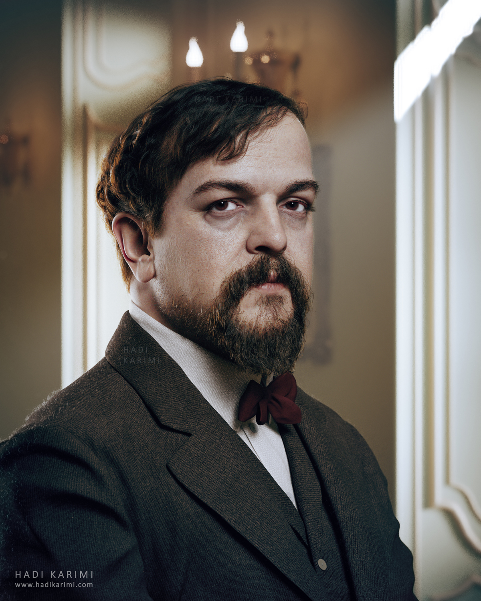

# Chart de lune 🎵

Using Swift Charts and Voiceover Chart Descriptor to compose music. 🤯



Image source: https://hadikarimi.com/portfolio/claude-debussy-1908

### Output

> Note: Turn the **sound on** to hear the output

Song: *Clair de Lune* by Claude Debussy

https://user-images.githubusercontent.com/16542463/182043348-45721863-f3da-4c25-a7f5-37e597f6e787.mp4

### Method

A basic chart was used with a scale from 0-100 for simplicity.

Setting the `AXDataSeriesDescriptor` `isContinuous` value to `true` will play the graph curves, what we want is discrete notes, so we set this value to `false`.

Using [Piano Key Detector](https://apps.apple.com/al/app/piano-key-detector/id1612601920) app, the discrete sounds were mapped to music notes across intervals of `5`.

```Swift
//        .init(time: 0, value: 0), // C5
//        .init(time: 1, value: 5), // D5
//        .init(time: 2, value: 10), // D5
//        .init(time: 3, value: 15), // D#5
//        .init(time: 4, value: 20), // E5
//        .init(time: 5, value: 25), // E5
//        .init(time: 6, value: 30), // F#5
//        .init(time: 7, value: 35), // F#5
//        .init(time: 8, value: 40), // G#5
//        .init(time: 9, value: 45), // G#5
//        .init(time: 10, value: 50), // A#5
//        .init(time: 12, value: 55), // A#5
//        .init(time: 13, value: 60), // B5
//        .init(time: 14, value: 65), // C6
//        .init(time: 15, value: 70), // C#6
//        .init(time: 16, value: 75), // D6
//        .init(time: 17, value: 80), // D#6
//        .init(time: 18, value: 85), // E6
//        .init(time: 19, value: 90), // F6
//        .init(time: 20, value: 95), // F#6
//        .init(time: 21, value: 100) // G6
```

Once the notes were identified, a simple version of <i>Clair de Lune</i> was found, https://www.youtube.com/watch?v=ra08MiW8jLw

This was manually mapped to the music notes identified above, with pauses in the song where appropriate. 
